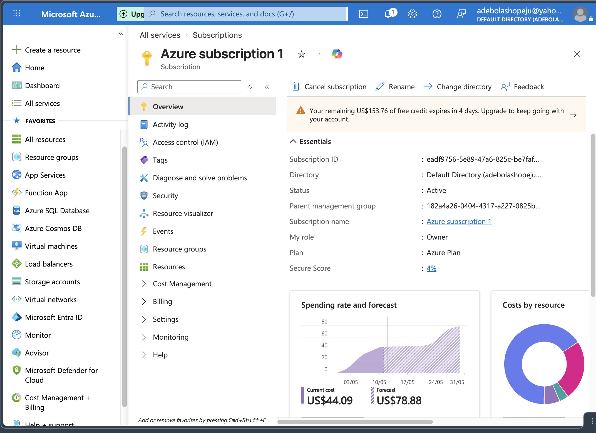
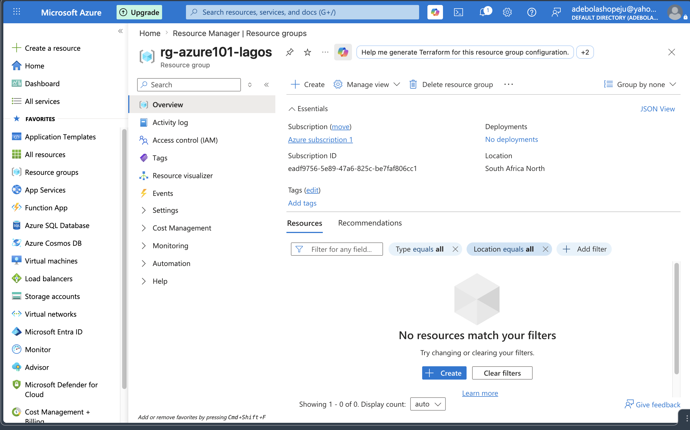
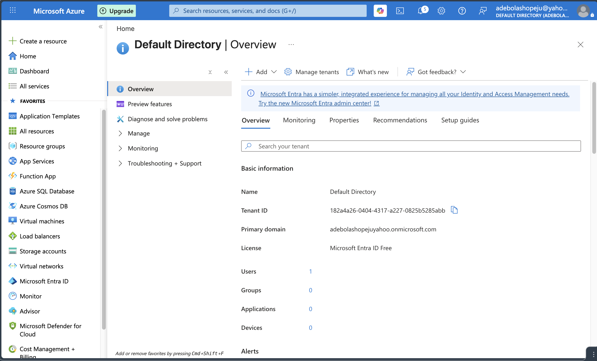
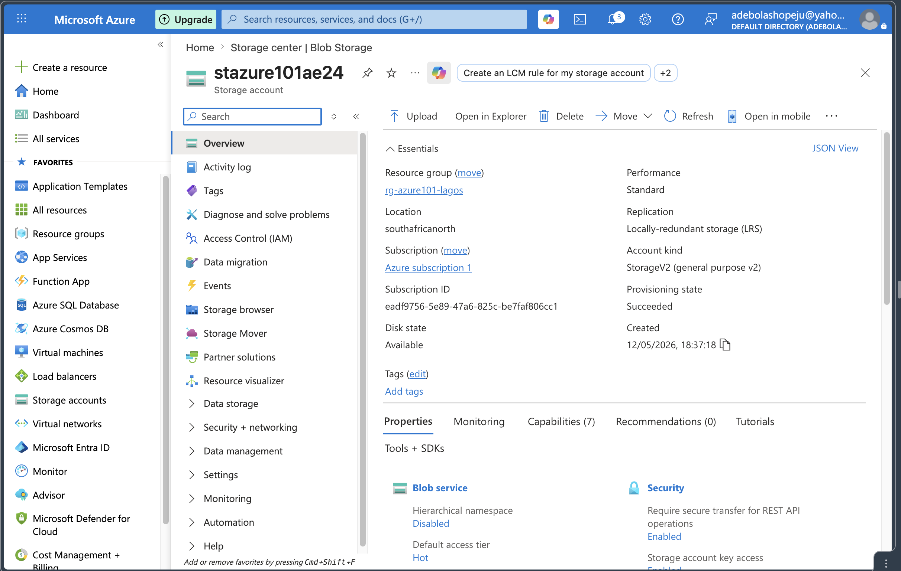
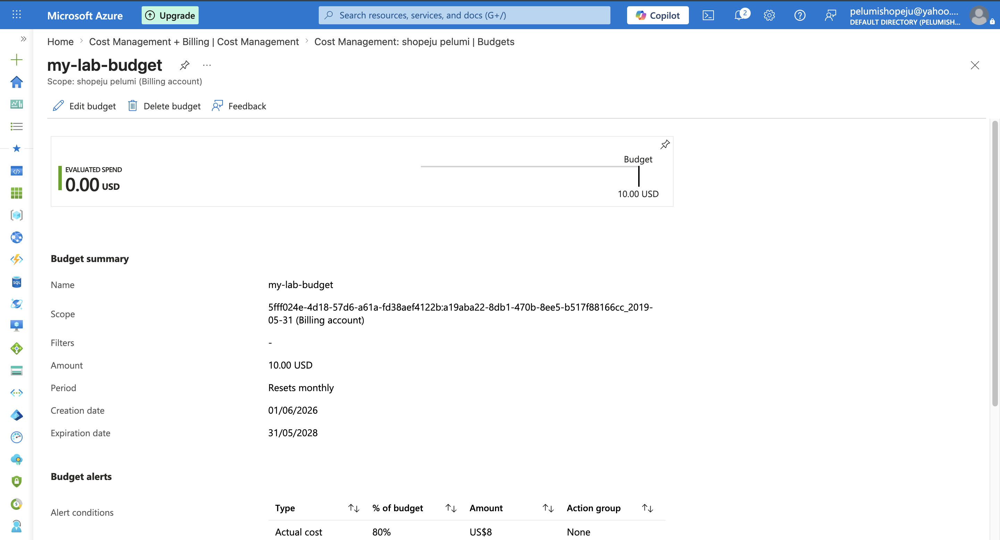

# Azure 101 Lab - Cloud Onboarding

**Student:** Adebola Shopeju  
**Subscription:** Azure for Students  
**Region:** South Africa North  

---

## Overview

This project documents the setup and configuration of a Microsoft Azure 
Free Tier account as part of the CloudOps training program. It covers 
portal navigation, resource group creation, identity management, 
resource deployment, and cost monitoring.

---

## Submission Files

### 1. Verification Screenshot — Active Subscription
Shows the Azure Portal with active subscription details.

---

### 2. Resource Group Confirmation
Resource Group `rg-azure101-lagos` created in South Africa North region.

---

### 3. Identity Awareness — Microsoft Entra ID (RBAC)
Shows Microsoft Entra ID overview with user management and 
Role-Based Access Control explored.

---

### 4. Resource Deployment Evidence — Storage Account
Storage Account `stazure101ae24` successfully deployed in 
South Africa North. Provisioning State: Succeeded.

---

### 5. Cost Management Evidence — Budget Configured
Budget `my-lab-budget` created with $10 limit and 80% alert threshold.

---

## Summary Report

See [Summary-Report.md](Summary-Report.md) for:
- Region selection reasoning
- Shared Responsibility Model explanation
- IaaS vs PaaS vs SaaS breakdown

---

## Key Learnings

- Azure Free Tier provides $200 credit for 30 days
- Resource Groups act as logical containers for cloud resources
- Microsoft Entra ID manages identity and access (RBAC)
- Cost Management budgets prevent unexpected charges
- South Africa North chosen for lowest latency from Lagos, Nigeria

---

## Cost Summary

Total cost incurred during lab: less than $0.05  
All resources deleted after submission.
